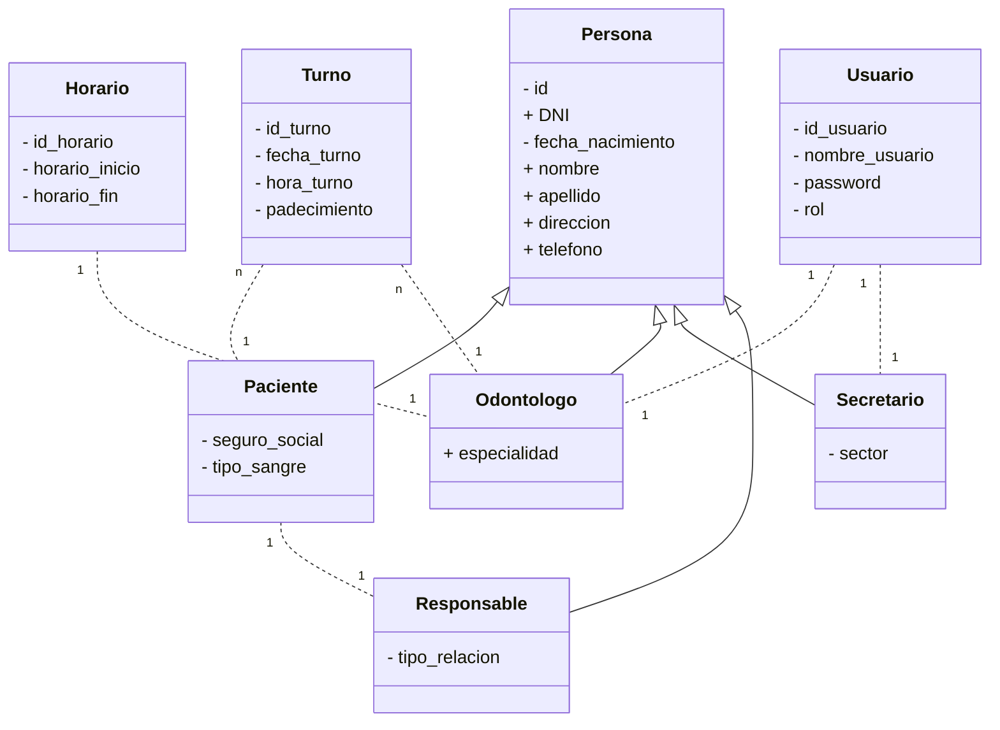

Una clinica odontologica necesita de una aplicación web para adminsitrar los datos y turnos de cada uno de sus pacientes. Al mismo tiempo, cuenta con diferentes odontologos (con sus respectivas especialidades) que pueden ser asignados a cada uno de los turnos de estos pacientes.

Cada __odontologo__ tiene su propio __horario__ de atencion, y solo se le puenden asignar pacientes en dichos dias y horarios.

En caso de que se requiera una fecha y horario en que el odontologo no trabaje, el sistema debe manifestar una advertencia y no permitir el ingreso del turno.

Cada paciente debe estar registrado dentro del sistema en conjunto con sus datos personales, especificacion de si cuenta con seguro o si pagara de forma particular, el tipo de tratamiento que necesita, afeccion que posee o se es control de rutina, etc.

En caso de que el paciente sea menor de edad, se debe poder asignar un responsable.

El sistema debe contar con login (control de acceso) y sera utilizado principalmente por las secretarias de la clinica. Para poder llevar a cabo el control de acceso, se debe tener en cuenta el uso de usuarios y contraseñas que permitan el ingreso al sistema.

Ademas de los secretarios, cada odontologo podra acceder al sistema para visualizar los turnos de sus pacientes. Ademas de esto, podra registrar nuevos turnos y asignar una observacion del trabajo realizado luego de atender al paciente.

El sistema debera poder permitir visualizar las siguientes consultas / informes:

- Cantidad de pacientes atendidos en un determinado dia
- Turnos de cada odontologo por dia
- Cantidad de pacientes con seguro y sin el
- Cualquier otro informe o consulta que pueda ser necesario

JDK15 - Java EE7
HTML - CSS - JSP - JPA
SB Admin 2 - Start Bootstrap 4

