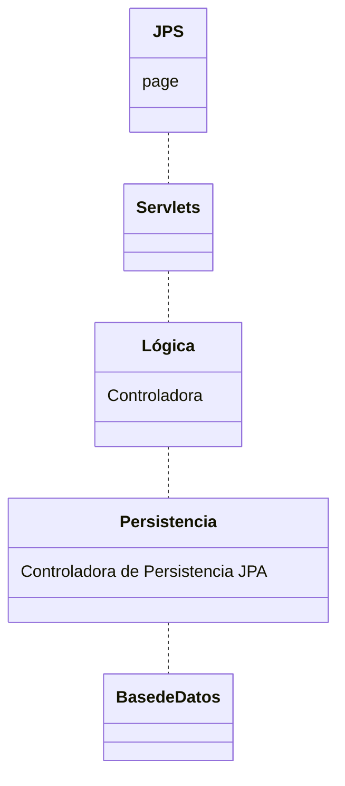

Maven Repositories

Projects > Dependencies > Add dependencies > buscar mySQL

- Crear conexion a la base de datos
> Services > Databases > New Connection > seleccionamos el driver y configuramos
jdbc:mysql://localhost:3306/clinica_odontologica?serverTimezone=UTC

- Crear la JPersistenceUnit
Projects > Source Packages > persistencia > add.. > Persistence > Persistence Unit
nombramos Proyecto_PU con la libreria y la conexion
En la unidad de pesristencia Include Entity Classes > Add Class... > todas

- agregar los JPA controllers
Projects > Project Source Packages > persistencia > add.. > Persistence > JPA Controller Classes from Entity Classes
agregamos todas las clases de entidad
en Package de "persistencia" cree todos los JPA Controllers

- crear clase controladora de la logica

