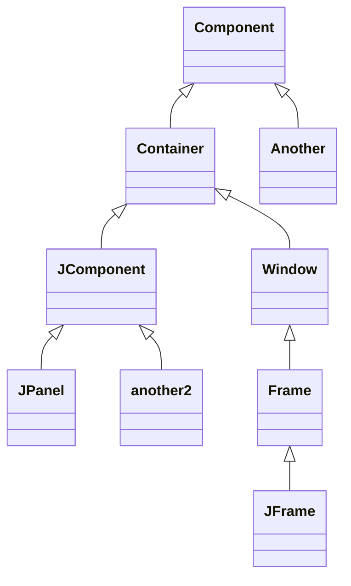

## Componentes Swing

Los **frames** (como JFrame) son contenedores, por lo que incluyen un "panel de contenido" (*content pane*) al cual se le pueden añadir componentes graficos y otros contenedores (como paneles *JPanel*).

## Distribución del espacio (layout management)

Los *layout managers* controlan la forma en la que colocan los componentes dentro de un contenedor.

**FlowLayout** (por defecto en *JPanel*)
**BorderLayout** (por defecto en *JFrame*)
**GridLayout**
**GridBagLayout**

Se pueden crear gestores propios de layout si se implementan las interfaces *java.awt.LayoutManager* y *java.awt.LayoutManager2*.

