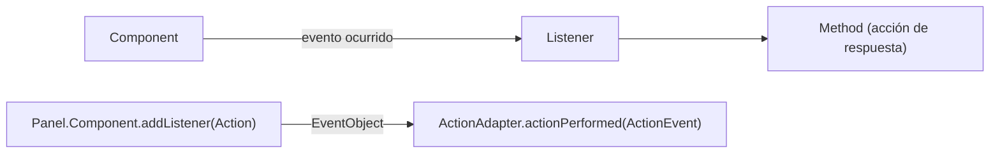
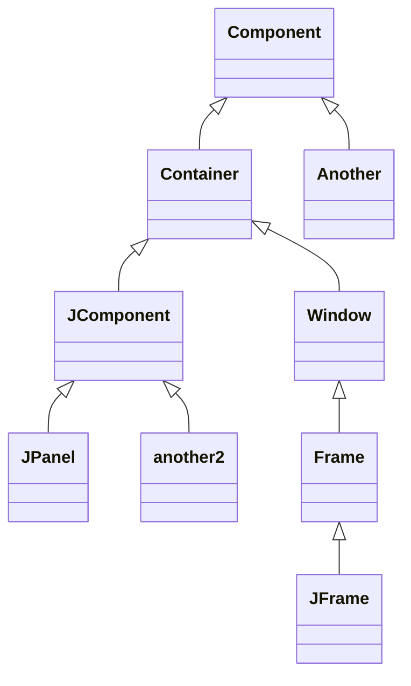

Cada uno de los componentes gráficos tiene una lista de **Event**s predeterminados, y para asignarlos se utiliza un **Listener**. Para manipular eventos se requiere.

    - Component
    - Listener
    - Adapter
    - Indicar el evento deseado a detectar
    - Tipo de evento
    - Acciones a seguir si se detecta el evento indicado

En términos de objetos y métodos, el manejo de eventos en Java funciona de la siguiente forma:
- Los manejadores de eventos (event listeners) se registran en las distintas fuentes de eventos (event source).
- Una fuente de eventos (mouse, botón, ventana) envía objetos de tipo **EventObject** a todos los manejadores registrados cuando se produce un nuevo evento.
- Cada manejador de eventos utiliza la información recibida a través del objeto de tipo **EventObject** para realizar las acciones que estime adecuadas.

## Componentes Swing

