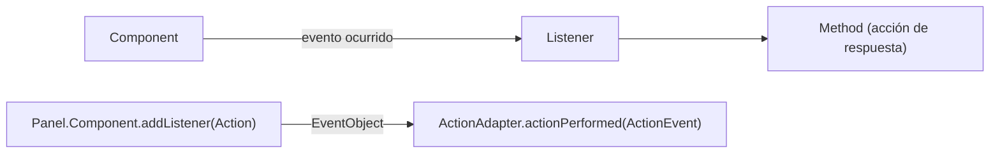

Cada uno de los componentes gráficos tiene una lista de **Event**s predeterminados, y para asignarlos se utiliza un **Listener**. Para manipular eventos se requiere.

    - Component
    - Listener
    - Adapter
    - Indicar el evento deseado a detectar
    - Tipo de evento
    - Acciones a seguir si se detecta el evento indicado

En términos de objetos y métodos, el manejo de eventos en Java funciona de la siguiente forma:
- Los manejadores de eventos (event listeners) se registran en las distintas fuentes de eventos (event source).
- Una fuente de eventos (mouse, botón, ventana) envía objetos de tipo **EventObject** a todos los manejadores registrados cuando se produce un nuevo evento.
- Cada manejador de eventos utiliza la información recibida a través del objeto de tipo **EventObject** para realizar las acciones que estime adecuadas.

Los *Listener*s deben registrarse o estar de acuerdo con la clase de origen de eventos (*EventSourceClass*) para recibir cualquier notificación. Esto significa que un evento (*Event*) en particular es procesado solo por un *Listener* específico.

## Delegación Evento Modelo de Java: Events, Sources y Listeners
Un componente puede ser mapeado por numerosos tipos de eventos, por lo que Java utiliza una convención de nomenclatura muy intuitiva.

**Events**: el objeto event define el cambio de estado en la clase origen del evento. El objeto evento se utiliza para transportar la información requerida sobre el cambio de estado. Sin embargo, hay eventos que no dependen de la interacción del usuario. Se producen automáticamente, por lo que podemos definir el procedimiento para manejarlos una vez que ocurren.

**Event sources**: los orígenes de eventos son objetos que hacen que los eventos ocurran debido a algún cambio en la propiedad del componente. Debido a que puede haber varios tipos que un componente puede desencadenar, cada uno debe registrarse en un Listener para proporcionar una respuesta adecuada.

**Event listeners**: los detectores de eventos son objetos que se notifican tan pronto como ocurre un evento específico. Los detectores de eventos deben definir los métodos para procesar la notificación que les interesa recibir.

## Listener Interface and Adapter Classes in Java

En la jerarquía de eventos de Java, podemos encontrar que algunas interfaces de escucha dependen de más de un controlador de eventos. Entre ellos, solo algunos de los métodos de manejo de eventos contienen algún código significativo. La mayoría se declaran como un cuerpo vacío. Se supone que estos métodos están definidos por sus clases de implementación. Supongamos que queremos implementar un evento de mouse: podemos implementar algunos o todos los eventos de mouse implementando interfaces de escucha o extender la clase de adaptador y definir solo los eventos requeridos que queremos procesar.

Las clases de adaptador *ClassAdapter* implementan la interfaz de escucha correspondiente *ClassListener*. Todos los métodos de evento se derivan de las interfaces de escucha, pero las clases de adaptador correspondientes no proporcionan ningún cuerpo del método de evento. Estas clases de adaptadores se designan como *abstract* y están destinadas a ampliarse. La clase que se extiende define uno o más de los métodos para contener la lógica del proceso de manejo de eventos. Las clases adaptador siguen el patrón de adaptador. Sin embargo, no todos los *listener*s tienen sus clases de adaptador correspondientes en la API de Java.

La idea detrás del modelo de eventos de delegación es bastante simple: implementar una interfaz adecuada en el oyente para recibir el evento y registrarlo en el código para la notificación de eventos. Debido a que existen numerosos tipos de eventos, cada uno debe registrarse por separado para un oyente apropiado. Las clases de adaptador simplifican la implementación de eventos en ciertas situaciones, como cuando necesitamos manejar solo algunos de los eventos que maneja una interfaz de escucha de eventos en particular. Las principales API relacionadas con eventos en Java se encuentran en los paquetes *java.awt.event*, *java.awt* y *java.util*.
Consulte la documentación de la API de Java para obtener detalles específicos sobre ellos.

https://www.developer.com/project-management/understanding-and-using-the-java-delegation-event-model/
