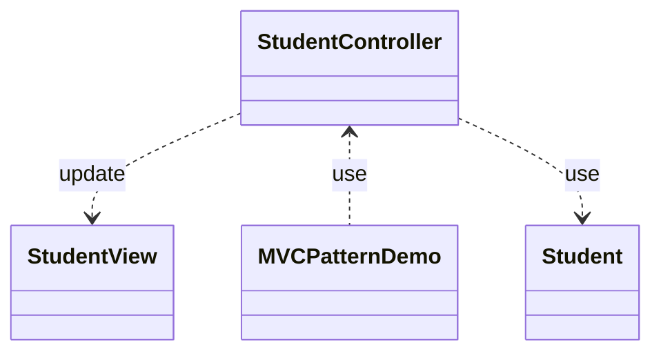
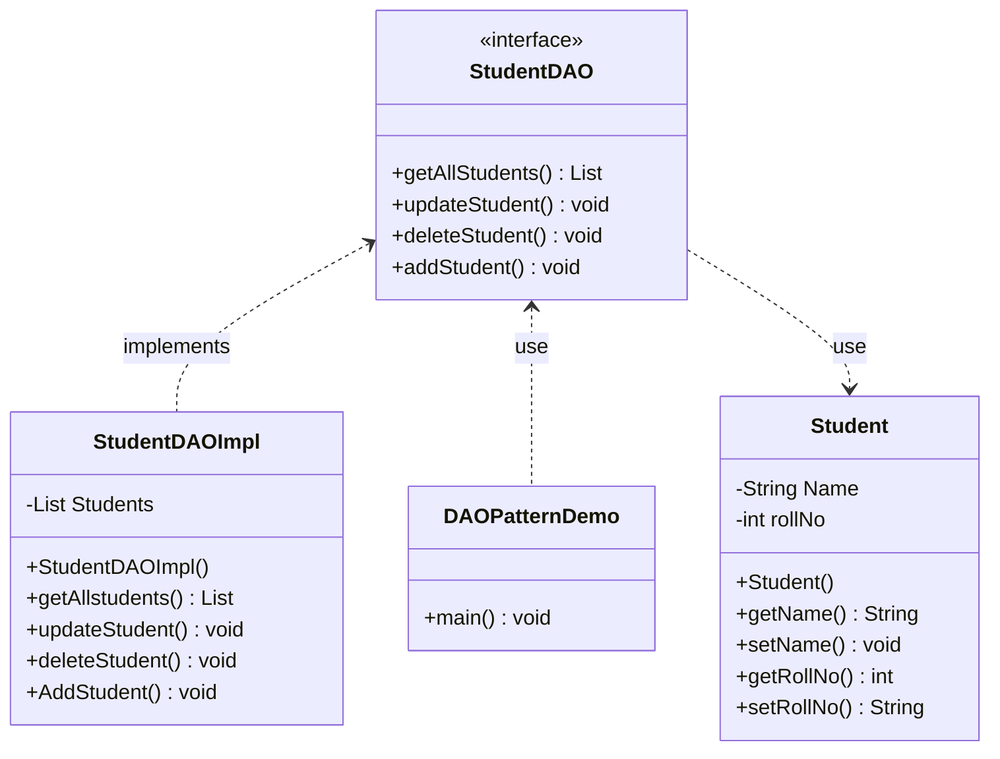

 # MVC pattern

```mermaid
classDiagram

StudentController ..> StudentView: update
StudentController <.. MVCPatternDemo: use
StudentController ..> Student: use


```

 # DAO pattern

```mermaid
classDiagram

StudentDAO <.. StudentDAOImpl: implements
StudentDAO <.. DAOPatternDemo: use
StudentDAO ..> Student: use

class StudentDAO{
    <<interface>>
    +getAllStudents() List
    +updateStudent() void
    +deleteStudent() void
    +addStudent() void
}

class Student{
    -String Name
    -int rollNo
    +Student()
    +getName() String
    +setName() void
    +getRollNo() int
    +setRollNo() String
}

class DAOPatternDemo{
    +main() void
}

class StudentDAOImpl{
    -List Students
    +StudentDAOImpl()
    +getAllstudents() List
    +updateStudent() void
    +deleteStudent() void
    +AddStudent() void
}
```
