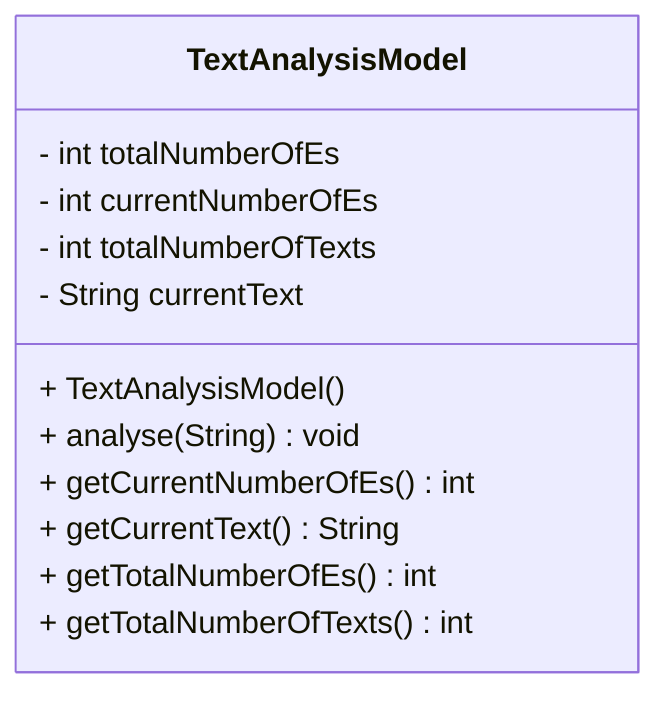

To the right of the text ‘Enter text:’ is an editable area 
where the user can enter or change text. If one clicks on 
the button ‘Analyse’ then a small analysis of the text is 
performed and the result is displayed in the following way. 
The text is converted to capital letters and copied into 
the area to the right of ‘Current text:’. The number of 
occurrences of the letter ‘E’ in upper or lower case is 
displayed to the right of ‘No. of Es in current text:’.
At the same time the content of the user editable area 
is erased.

